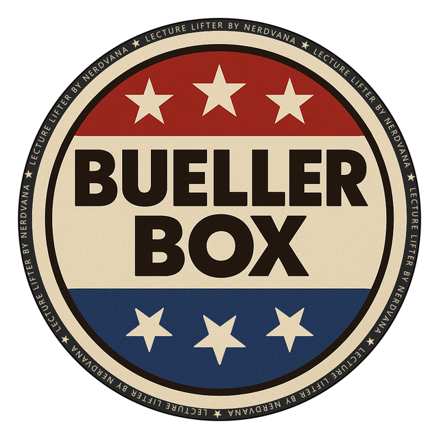

<p align="center">
  
</p>

<p align="center">
  
  
  
  
  
  
  
</p>


# 📦 Bueller Box

Welcome to **Bueller Box**, the retro-fueled lecture media collector from the Nerdvana suite.  
This is the ultimate WinAmp-style academic mixtape builder for the curious, the nostalgic, and the always-late-to-class.

---

## 📁 Repository Structure

```
BuellerBox/-
├── README.md
├── .gitignore
├── requirements.txt
├── assets/
│   ├── bueller_box_github.png
│   ├── bueller_box_favicon_refined.png
│   └── bueller_box_stamped.png
├── docs/
│   └── overview.md
├── chat_logs/
│   └── nerdvana_it_awakens_migration.md
├── dev_log/
│   └── PROJECT_LOG.md
└── src/
    ├── __init__.py
    ├── kaltura_downloader.py
    └── slides_capturer.py
```

---

## 🎯 Module Purpose

**Bueller Box** is a standalone module in the Nerd-Army-Calculator built to:

- Capture and organize Google Slides, Kaltura videos, and lecture-related assets  
- Archive transcripts, attachments, and metadata  
- Store everything locally or sync to a structured Nerdvana cloud vault  
- Do it all with unapologetic 90s flair  

---

## 💾 Current Features

- [ ] Google Slides Capturer (WIP)
- [ ] Kaltura Downloader (WIP)
- [ ] Lecture Timeline Annotator (TBD)
- [ ] Transcript & Attachment Organizer
- [ ] Retro-themed GUI w/ nostalgic skins

---

## 🔧 Setup

```bash
# Clone the repo
git clone https://github.com/sintaxandcaffine/BuellerBox.git
cd BuellerBox

# Set up Python environment
python -m venv venv
# On PowerShell
.env\Scripts\Activate.ps1

# Install dependencies
pip install -r requirements.txt
```

---

## 🏷️ Assets

- Logo Badge: `assets/bueller_box_github.png`
- Favicon/Icon: `assets/bueller_box_favicon_refined.png`
- Stamped Vintage: `assets/bueller_box_stamped.png`

---

## 🕹️ Retro Goals

> “Life moves pretty fast. If you don’t stop and capture your lectures once in a while, you could miss it.”  
> — *Ferris, probably*

---

> *Module powered by SinTaxAndCaffeine – For Nerds Who Never Skip Class.*
